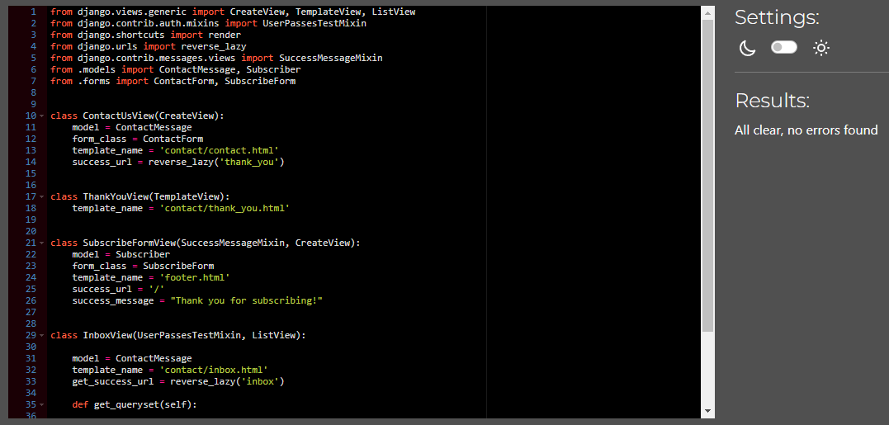

# [By Noveline ](https://by-noveline-a60b58beb7bd.herokuapp.com/)

## Table of Contents

- [By Noveline](#by-noveline)
- [SEO & Marketing Research](SEO_MARKETING_RESEARCH.md)
- [UX](#ux)
- [Agile Methodology](#agile-methodology)
- [Entity-Relationship Diagram](#entity-relationship-diagram)
- [Features](#features)
  - [Existing Features](#existing-features)
- [Design](#design)
  - [Logotype](#logotype)
    - [Favicon](#favicon)
  - [Color Scheme](#color-scheme)
  - [Wireframes](#wireframes)
- [Technologies Used](#technologies-used)
- [Testing](#testing)
  - [Responsiveness & Performance](#responsive-&-performance)
    - [Lighthouse Testing](#lighthouse-testing)
  - [Code Validation](#code-validation)
  - [Feature Testing](#feature-testing)
- [Deployment](#deployment) 
- [Credits](#credits)
- [Acknowledgements](#acknowledgements)

***

## By Noveline

This e-commerce website was built on the request of a family owned business that wanted to expand their target market. Their customers was before obligated to visit a pysical store to explore the products and By Novelines market was limited. By building them a userfriendly and elegant webshop could By Novelines market expand World Wide.

BY Noveline offers elegant and luxury engagement, and weddingrings that is made on request from the customer.

*By Noveline is a fictive business*

## SEO & Marketing Research

[Read Document](SEO_MARKETING_RESEARCH.md)

## UX

The goal for the e-commerce website By Noveline is to create a user-friendly and secure application where customers can browse products, save them to their shopping cart and then purchase them with full security through Stripe Payments.

## Agile Methodology

Agile was used for efficient planning and development of the website, ensuring alignment with UX requirements.

11 Milestones with related EPIC's divided into UserStorys, UserStory-Admin and Development was setup and followed to fullfil the development of the project By Noveline.

Full project planning can be found here:
[Project Kanban Board for By Noveline](https://github.com/users/SaraTisell/projects/6)

## Entity-Relationship Diagram

ERD

## Features

### Existing Features

#### Navigation

Navigation meanu is visible for all users and placed in the header.
* Logotype
  * Navigates a user back to home page
* Product nav
  * Takes a user to the desired product page
    * All products
    * Gold Rings
    * Silver Rings
    * Ring Sets
* Profile
  * Regular User
    * SignUp
    * Login
  * User with account 
    * My Profile
      * Order History
      * Personal Info
      * Wishlist
      * Logout
  * Admin user 
    * Orders
    * Product Management
    * Inbox
    * Logout
* Shopping Cart
  * Checkout

#### Footer Navigation

* Customer Service
  * Contact us
  * Privacy Policy

#### Favicon

A favicon inspired by the logotype is implemented to imporve ux. The favicon helps the user to recognise By Novelines page inside the browser tabs.

#### Home Page 

The homepage display insperation image with link to product page.

#### Account

A user has the possibility to create an account to save and store their personal information, see order history and save products to their wishlist.

#### Shopping Cart

A user, with or without an account is able to add/remove products from their shoppingcart. If the user want to purchase, they can easy go to shopping cart and navigate to secure checkout. 

#### Checkout 

A user is able to fill in valid information and purchase products at the ceckout page. If the user has an account, they are able to save the information to their profile.

#### My Profile

A user has their own profile page where they can see their order history, personal information and wishlist.
#### Wishlist

A user with an account can save products to their wishlist and display these later isnide their own profile page.

#### Admin Features

Admin has their own profile navigation including:
* Orders
  * All orders is displayed at this page with information regarding the order
* Product Management
  * Add product
  * Edit product
  * Delete product
* Inbox
  * Messages sent through the contact form is displayed at inbox page

#### Contact

A user is able to send in a contact form if they desire to get in touch with the team at By Noveline.

#### Product Pages

Four different pages is displayed at the header menu

* All products
  * Includes all product avaiable in the store
* Gold Rings
  * All product in the category gold rings
* Silver Rings
  * All products in the category silver rings
* Ring Sets
  * All products in the category ring sets

#### Search Function

The user is able to search for specific products through the search form.

## Design 

### Logotype

### Favicon

### Color Scheme 

### Wireframes

Wireframe Mobile Device

Wireframe Mobile Device

Wireframe Tablet

Wireframe Desktop

## Technologies Used

* HTML
  * Website structure was developed using HTML as the main language
* CSS
  * Custom CSS in an external file to style the website
* Python 
  * Python was the main programming language for application using The Django Framework
* Django 
  * Django Framework was used to build this fullstack application
* Bootstrap
  * Boostrap Framework was used for Front-end development
* Stripe
  * For payments
* GitPod
  * Gitpod IDE was used to develope the website
* GitHub
  * Githud is used to host source code
* Git
  * Used to commit and push code from GitPod to GitHub during development of the website
* [Privacy Policy Generator](https://www.privacypolicygenerator.info/)
  * Used to create privacy policy
* [XML-Sitemaps](https://www.xml-sitemaps.com/)
  * Used to create sitemap
* Canva
  * Was used to design logotype, favicon & color scheme
  * Used to Create product images
* Favicon.io
  * Was used to create favicon
* Pixelied
  * Used to convert png to webp
* Font Awesome
  * Used to implement icons
* Google Fonts
  * Used to add fonts

## Testing

### Responsiveness & Performance

#### Lighthouse Testing

### Code Validation 

#### HTML Validation

All HTML code were validated through W3C HTML Validation Service by direct input. Direct input were used due to limitation to access pages.

* Warnings and errors due to the use of Django template snippets.

#### CSS Validation

CSS code were validated through W3C CSS Validation Service by direct input

* No errors were found in the CSS files

#### PEP8 Validation

All py files were validated through CI Python Linter

A large number of files showed error of trailing whitespace & long lines. Most of the files were fixed and are clear except:
* webook.py & webhook_handler.py
  * These files are critical for the project's checkout function, and the function was easily broken when attempting to clear errors. Further investigation is needed to properly break these lines to adhere to the guidelines of PEP8.

### Feature Testing

Features were tested and documentet. Results & notes is showed below

#### Navigation Testing

#### Account Testing

#### Profile Testing

#### Wishlist Testing

#### Shopping Cart Testing

#### Checkout Testing

#### Contact Testing

#### Subscribe Testing

## Deployment

The project By Noveline was hosted on GitHub and deployed on Heroku by these steps

* Make your code repo ready for deployment
  * Set DEBUG = False
  * Commit and push code to GitHub
* Navigate to Heroku and login
  * From Heroku dashboard, create a new app
   * Select region
   * Giv you app a unique name
* Navigate to settings tab and click reveal config vars. __Add Following config vars:__
  * *For Security & Authentication*
    * SECRET_KEY
  * *For Database*
    * DATABASE_URL
  * *For Stripe*
    * STRIPE_PUBLIC_KEY
    * STRIPE_SECRET_KEY
    * STRIPE_WH_SECRET
  * *For AWS*
    * AWS_ACCESS_KEY_ID
    * AWS_SECRET_ACCESS_KEY
    * USE_AWS
  * *For EMAIL*
    * EMAIL_HOST_PASS
    * EMAIL_HOST_USER
* Click on deploy tab and connect to github
  * Search for repo and click on the one you want to deploy
  * Scroll down to manual deploy
  * Select (main) branch
  * Click Deploy Branch
* Open app to view the live site