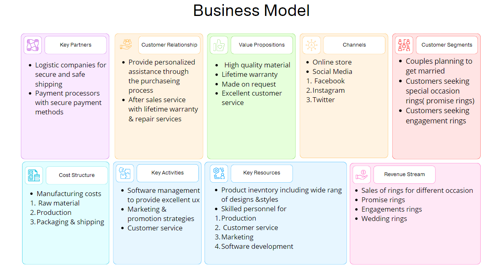
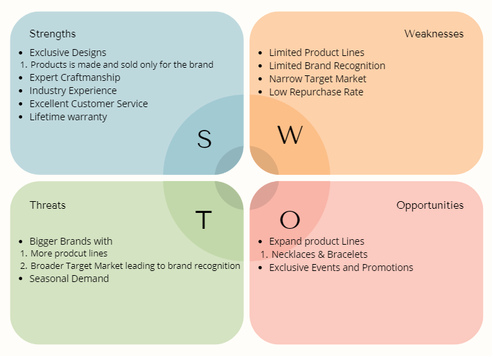
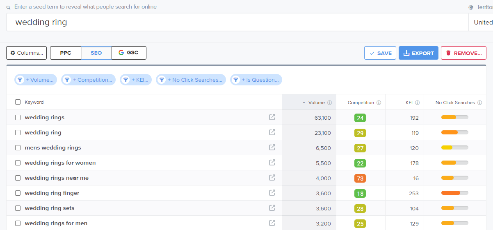
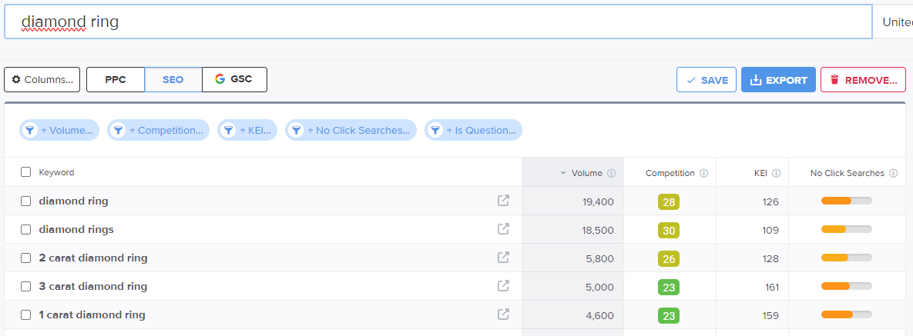

## SEO & MARKETING RESEARCH FOR BY NOVELINE

## Table of contents

- [Business Model](#business-model)
- [Target Market](#target-market)
- [Competition Research](#competition-research)
  - [SWOT Analysis](#swot-analysis)
  - [Competition](#competition)
- [SEO Improvements](#seo-improvements)
  - [Keyword Research](#keyword-research)
    - [META Tags](#meta-tags)
  - [Sitemap](#sitemap)
  - [robots.txt file](#robots.txt-file)
- [Marketing Strategies](#marketing-strategies)
  - [Facebook Page](#facebook-page)
  - [Newsletter Subscription](#newsletter-subscription)
  - [Privacy Policy](#privacy-policy)

## Business Model
By Novelines Business Model for Business to Consumer (B2C).

## Target Market

By Novelines target market consists of:
* Bride & Grooms / Engaged Couples
  * People who activly are planning their wedding
* Couples
  * People who seeking rings to get engaged
  * People who seeking promise rings
* Partner
  * Person seeking engagement ring for proposal

By Noveline operates in a niche industry market for wedding and engagement rings. As the market is niched its important to understand how to attract the audience. As the business strives to be the obvious choice for people looking for engagement/wedding rings, in addition to offering quality products, we focus on personal service, attention to detail and a deep understanding of our customers' wishes.

## Competition Research

### SWOT Analysis
A brief SWOT Analysis were made for By Noveline to point out Strengths, Weaknesses, Threats & Opportunities

### Competition

The Competition for By Noveline is very strong, as the market is saturated with established companies. The research highlights the need for the business not only to be strong but also to have an exceptional marketing strategy to carve out its niche among the competition. The primary challenge lies in the broader product offerings and expansive target markets of major competitors, which fosters customer loyalty in the pursuit of engagement and wedding rings. By Noveline's specialization in rings alone presents a unique barrier, requiring innovative methods to assert its presence and gain market share within the industry. Strategic differentiation and commitment to quality and customer satisfaction will be critical to overcoming these challenges and establishing By Noveline as a leading player in the industry.

## SEO Improvements

Site Engine Optimisation is crucial for improving online visibility, attracting organic traffic and increasing website ranking on SERPs (search engine results pages). By optimazing By Novelines website content, research and implement relevant *Keywords* in META tags, and add a sitemap for the websites structure to help search engine crawlers to index the site's pages, the business is more likely to reach their target market leading to increased conversions and sales.

### Keyword Research
Researching and choosing relevant keywords that are in line with By Novelines target markets search intent and implement these keywords naturally and strategically into the website content will help the business to rank higher on SERPs and drive relevant traffic.

#### Choosing Keywords
[Wordtracker](https://www.wordtracker.com/) was used for the purpose to research relevant keywords to use for By Noveline SEO. 

During the research of relevant keywords there was focus on selecting terms based on their volume and level of competition. One notable keyword for By Noveline is *wedding rings* instead of *wedding ring*, as it offers a significantly higher search volume and lower competition. This stretgic approach was used for the selected keywords to optimize By Novelines online visibility and competitiveness within the market.

Keywords:
* by noveline
* engagement rings
* wedding rings
* wedding ring sets
* gold
* gold rings for women
* gold ring for men
* white gold
* rose gold
* silver 
* silver rings
* sterling silver rings
* diamond ring
* 1 carat diamond ring

