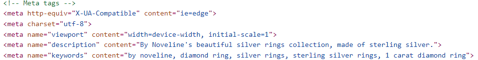
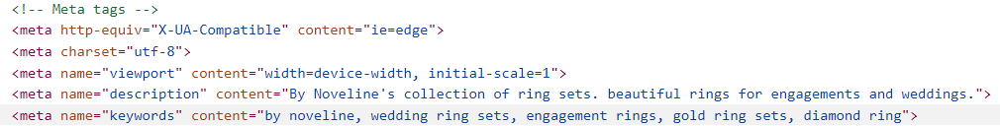
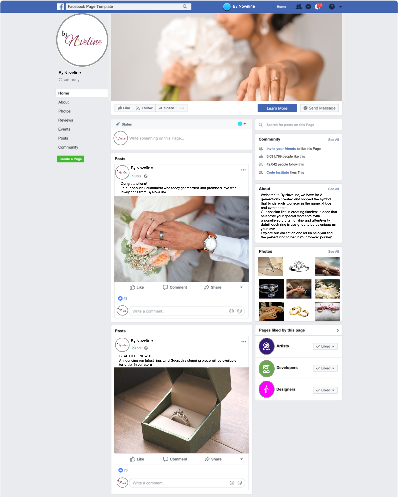
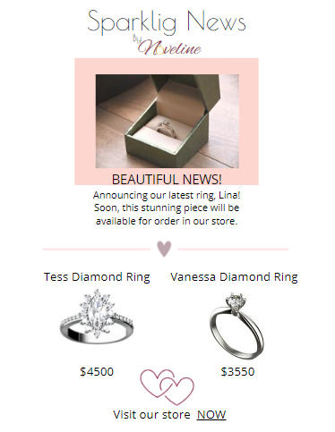

## SEO & MARKETING RESEARCH FOR BY NOVELINE

## Table of contents

- [Business Model](#business-model)
- [Target Market](#target-market)
- [Competition Research](#competition-research)
  - [SWOT Analysis](#swot-analysis)
  - [Competition](#competition)
- [SEO Improvements](#seo-improvements)
  - [Keyword Research](#keyword-research)
    - [META Tags](#meta-tags)
  - [Sitemap](#sitemap)
    - [robots.txt file](#robots.txt-file)
- [Marketing Strategies](#marketing-strategies)
  - [Facebook Page](#facebook-page)
  - [Newsletter Subscription](#newsletter-subscription)
  - [Privacy Policy](#privacy-policy)

## Business Model
By Novelines Business Model for Business to Consumer (B2C).

## Target Market

By Novelines target market consists of:
* Bride & Grooms / Engaged Couples
  * People who activly are planning their wedding
* Couples
  * People who seeking rings to get engaged
  * People who seeking promise rings
* Partner
  * Person seeking engagement ring for proposal

By Noveline operates in a niche industry market for wedding and engagement rings. As the market is niched its important to understand how to attract the audience. As the business strives to be the obvious choice for people looking for engagement/wedding rings, in addition to offering quality products, we focus on personal service, attention to detail and a deep understanding of our customers' wishes.

## Competition Research

### SWOT Analysis
A brief SWOT Analysis were made for By Noveline to point out Strengths, Weaknesses, Threats & Opportunities

### Competition

The Competition for By Noveline is very strong, as the market is saturated with established companies. The research highlights the need for the business not only to be strong but also to have an exceptional marketing strategy to carve out its niche among the competition. The primary challenge lies in the broader product offerings and expansive target markets of major competitors, which fosters customer loyalty in the pursuit of engagement and wedding rings. By Noveline's specialization in rings alone presents a unique barrier, requiring innovative methods to assert its presence and gain market share within the industry. Strategic differentiation and commitment to quality and customer satisfaction will be critical to overcoming these challenges and establishing By Noveline as a leading player in the industry.

## SEO Improvements

Site Engine Optimisation is crucial for improving online visibility, attracting organic traffic and increasing website ranking on SERPs (search engine results pages). By optimazing By Novelines website content, research and implement relevant *Keywords* in META tags, and add a sitemap for the websites structure to help search engine crawlers to index the site's pages, the business is more likely to reach their target market leading to increased conversions and sales.

### Keyword Research
Researching and choosing relevant keywords that are in line with By Novelines target markets search intent and implement these keywords naturally and strategically into the website content will help the business to rank higher on SERPs and drive relevant traffic.

#### Choosing Keywords
[Wordtracker](https://www.wordtracker.com/) was used for the purpose to research relevant keywords to use for By Noveline SEO. 

During the research of relevant keywords there was focus on selecting terms based on their volume and level of competition. One notable keyword for By Noveline is *wedding rings* instead of *wedding ring*, as it offers a significantly higher search volume and lower competition. This stretgic approach was used for the selected keywords to optimize By Novelines online visibility and competitiveness within the market.

Keywords Ideas:
* by noveline
* wedding ring
* ring sets
* rose gold ring
* silver ring
* gold ring
* engagement rings
* diamond rings
* wedding ring set

Choosen Keywords:
* by noveline
* engagement rings
* wedding rings
* wedding ring sets
* gold
* gold rings for women
* gold rings for men
* white gold
* rose gold
* silver 
* silver rings
* sterling silver rings
* diamond ring
* 1 carat diamond ring

#### META Tags

To implement the choosen keywords into the HTML code for SEO we were using META Tags that is placed inside the "head" section. The META Tags includes "meta name=description" & "meta name=keywords". These are used to help search engines to understand the content and context of the page to enhancing the visability for users searching for relevant keywords.

##### Using right Keyword at the Right Page
By avoiding misleading content and context, it is important to use the right keyword on the right page; there is no meaning in adding "gold rings for men" on a page featuring "Silver Rings." Therefore, aligning the selected keywords with the specific products on each page provides clarity for both search engines and users and helps improve the effectiveness of By Noveline's SEO strategy.

*Meta Tags for Silver Rings*

*Meta Tags for Ring Sets*

### Sitemap

A sitemap.xml file is included to help search engine crawlers with the indexing process to ensure all relevant pages are included in search results. The file outlines the websites structure, listining all pages and its relationships, providing a comprehensive guide for search engine algorithms. By including the sitemap, By Novelines visibility and accessibility to users improves, ultimately optimizing the SEO performance.

#### robots.txt file

Additional to the sitemap, a robots.txt file is included in the root directory to hinder search enginer crawlers to index pages that should not be indexed due to private content that should not be visible for other users.

## Marketing Strategies

By Novelines main Marketing Strategies icludes *Content Marketing*, *Social Media Marketing* and *Email Marketing*, all of which synergize to effectivly promote By Noveline.

Creating and distributing valuable and relevant content for the By Noveline Brand enables meaningful engagement with the target market, fostering trust and loyalty while driving brand awareness. This content is then used for *Social Media Marketing* and *Email Marketing*

### Facebook Page

Having an active account and a vibrant Facebook page enables By Noveline to regularly post content and engage with its audience effectively. Facebook's extensive user base and diverse advertising options further enhance By Noveline's marketing efforts, allowing for targeted outreach and impactful brand promotion. Leveraging these advantages, By Noveline can cultivate a strong online presence, foster community engagement, and drive meaningful interactions with its audience on the platform.

### Newsletter Subscription

Email marketing is a powerful tool for By Noveline, users are able to subscribe to the newsletter directly on the website. These newsletters deliver timely and relevant information about the site and its products, keeping subscribers engaged and informed about the latest products and updates from By Noveline. This personalized approach to communication helps nurture relationships with both former and future potential customers.

*Email example*

